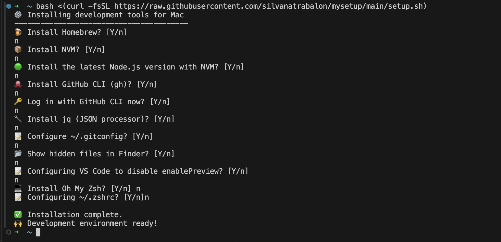

# My setup

Bash scripts to set up my Mac development environment.

## Overview
This repository contains modular shell scripts to automate the installation and configuration of essential development tools and settings on macOS. Each step is separated into its own script for clarity and flexibility.

## Structure
- `setup.sh` — Main script that sequentially runs all setup steps. For each step, you will be prompted to continue or skip (reply `no` to skip any step).
  - `01-homebrew` — Installs Homebrew
  - `02-nvm` —stalls NVM (Node Version Manager)
  - `03-node` — Installs the latest Node.js using NVM
  - `04-gh` — Installs GitHub CLI and offers to log in
  - `05-jq` — Installs jq (JSON processor)
  - `06-gitconfig` — Interactive setup for your Git configuration
  - `07-finder` — Optionally shows hidden files in Finder
  - `08-vscode` — Configures VS Code to disable editor preview

## 📦 Quick Install

Run this command in your terminal:

```bash
bash <(curl -fsSL https://raw.githubusercontent.com/silvanatrabalon/mysetup/main/setup.sh)
```




## Results
After running these scripts, you will have:

### Tools installed
- Homebrew, NVM, Node.js, GitHub CLI, and jq installed.

### Git configuration
- Your global `~/.gitconfig` set up with your name and email (default for your commits), and useful git aliases:
  - `git co` → `checkout`
  - `git br` → `branch`
  - `git ci` → `commit`
  - `git st` → `status`
  - `git squash` → interactive rebase with upstream main
  - `git pushf` → force push with lease to current branch
  - `git logmain` → log commits since main
  - `git pob` → push current branch to origin
- Your GitHub CLI (`gh`) will be authenticated and configured to use SSH for GitHub URLs.
- Optionally, a new SSH key generated and uploaded to GitHub (if you choose to do so during setup).

### Zsh Aliases
If you append the provided zsh config, you will have these aliases available:
- `gitconfig` → `code ~/.gitconfig`
- `zshconfig` → `code ~/.zshrc`
- `setgitemail` → Prompt the global and local setup for your git email
- `reload` → Reload your Zsh configuration
- `help` → List of commands

### Other preferences
- VS Code configured to disable editor preview tabs.
- Hidden files visible in Finder.

